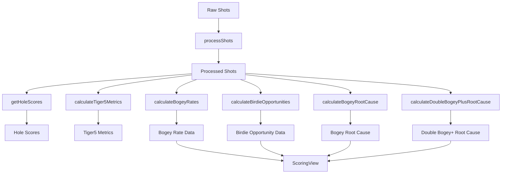

# Birdie and Bogey Breakdown - Implementation Plan

## Overview
Add a new "Birdie and Bogey Breakdown" section to the Scoring tab with the following components:
1. **Bogey Rate** - Bar chart showing % of holes with score >= par+1
2. **Birdie Opportunities** - Count and conversion percentage
3. **Bogey Root Cause** - Bar chart showing root causes of bogeys
4. **Double Bogey+ Root Cause** - Bar chart showing root causes of double bogeys+

---

## Data Definitions

### Bogey Rate
- **Definition**: % of holes where score >= par + 1
- **Categories**: Overall, Par 3, Par 4, Par 5
- **Calculation**: Count holes with score >= par+1 / Total holes × 100

### Birdie Opportunities
- **Definition**: A Birdie Opportunity occurs when:
  1. The player hits the Green in Regulation (GIR), AND
  2. The resulting putt start distance is <= 20 feet
- **GIR Definition**: A shot with starting lie "Green" for a score of par - 1
  - Example: Shot 3 has starting lie "Green" on a Par 4 = GIR
- **Conversion %**: % of Birdie Opportunities where birdie was made (score = par - 1)

### Root Cause Categories
Same categories as Tiger 5 Root Cause:
- **Penalties**: Shot resulted in penalty
- **Driving**: Shot type is Drive
- **Approach**: Shot type is Approach
- **Lag Putts**: Putts from 20+ feet
- **Makeable Putts**: Putts from 0-20 feet
- **Short Game**: Shot type is Short Game
- **Recovery**: Shot type is Recovery

### Root Cause Analysis Method
Similar to Tiger 5 Root Cause - for each bogey (or double bogey+) hole:
1. Identify the shot with the **lowest Strokes Gained** value (worst shot)
2. Categorize that shot using the categories above

---

## Implementation Steps

### Step 1: Add New Types (src/types/golf.ts)

Add new interfaces:
```typescript
// Bogey Rate by Par type
interface BogeyRateByPar {
  par: number;  // 0 for overall, 3, 4, 5 for specific par
  totalHoles: number;
  bogeyCount: number;
  bogeyRate: number;
}

// Birdie Opportunity metrics
interface BirdieOpportunityMetrics {
  opportunities: number;        // GIR with putt <= 20 feet
  conversions: number;           // Birdies made from opportunities
  conversionPct: number;         // conversions / opportunities * 100
}

// Root Cause for Scoring (Bogey/Double Bogey+)
interface ScoringRootCause {
  penalties: number;
  penaltiesSG: number;
  driving: number;
  drivingSG: number;
  approach: number;
  approachSG: number;
  lagPutts: number;        // 20+ feet
  lagPuttsSG: number;
  makeablePutts: number;   // 0-20 feet
  makeablePuttsSG: number;
  shortGame: number;
  shortGameSG: number;
  recovery: number;
  recoverySG: number;
}

// Complete Birdie and Bogey metrics
interface BirdieAndBogeyMetrics {
  bogeyRates: BogeyRateByPar[];
  birdieOpportunities: BirdieOpportunityMetrics;
  bogeyRootCause: ScoringRootCause;
  doubleBogeyPlusRootCause: ScoringRootCause;
  totalBogeys: number;
  totalDoubleBogeyPlus: number;
}
```

### Step 2: Add Calculation Functions (src/utils/calculations.ts)

Add new functions:
1. `calculateBogeyRates(shots, holeScores)` - Calculate bogey rate overall and by par
2. `calculateBirdieOpportunities(shots, holeScores)` - Calculate birdie opportunities and conversion
3. `calculateBogeyRootCause(shots, holeScores)` - Root cause for bogeys (score = par + 1)
4. `calculateDoubleBogeyPlusRootCause(shots, holeScores)` - Root cause for double bogeys+ (score >= par + 2)

### Step 3: Update useGolfData Hook (src/hooks/useGolfData.ts)

Add new metrics computation:
- Import new types
- Call calculation functions
- Add to returned object

### Step 4: Update ScoringView Component (src/App.tsx)

Add new section to render:
1. **Bogey Rate Bar Chart** - Grouped bar chart with 4 bars (Overall, Par3, Par4, Par5)
2. **Birdie Opportunities Section** - Cards showing opportunities count and conversion %
3. **Bogey Root Cause Chart** - Horizontal bar chart with 7 categories
4. **Double Bogey+ Root Cause Chart** - Horizontal bar chart with 7 categories

---

## Mermaid Diagram - Data Flow



---

## Component Layout

### Bogey Rate Section
```
┌─────────────────────────────────────────────────────────────┐
│  Birdie and Bogey Breakdown                                │
├─────────────────────────────────────────────────────────────┤
│  ┌──────────┐ ┌──────────┐ ┌──────────┐ ┌──────────┐      │
│  │ Overall   │ │ Par 3    │ │ Par 4    │ │ Par 5    │      │
│  │  XX.X%    │ │  XX.X%   │ │  XX.X%   │ │  XX.X%   │      │
│  └──────────┘ └──────────┘ └──────────┘ └──────────┘      │
│  [Bar Chart Visualization]                                │
└─────────────────────────────────────────────────────────────┘
```

### Birdie Opportunities Section
```
┌─────────────────────────────────────────────────────────────┐
│  Birdie Opportunities                          Conversion │
│  ┌──────────────────────┐  ┌──────────────────────┐    │
│  │  XX Opportunities    │  │  XX.X% Made          │    │
│  │  GIR + Putt <=20ft   │  │  Conversion Rate     │    │
│  └──────────────────────┘  └──────────────────────┘    │
└─────────────────────────────────────────────────────────────┘
```

### Root Cause Charts
```
┌─────────────────────────────────┐  ┌─────────────────────────────────┐
│  Bogey Root Cause              │  │  Double Bogey+ Root Cause     │
│  ┌─────────────────────────┐   │  │  ┌─────────────────────────┐   │
│  │ Penalties     ██  XX%  │   │  │  │ Penalties     ██  XX%  │   │
│  │ Driving      ██  XX%  │   │  │  │ Driving      ██  XX%  │   │
│  │ Approach     ██  XX%  │   │  │  │ Approach     ██  XX%  │   │
│  │ Lag Putts   ██  XX%  │   │  │  │ Lag Putts   ██  XX%  │   │
│  │ Makeable    ██  XX%  │   │  │  │ Makeable    ██  XX%  │   │
│  │ Short Game  ██  XX%  │   │  │  │ Short Game  ██  XX%  │   │
│  │ Recovery    ██  XX%  │   │  │  │ Recovery    ██  XX%  │   │
│  └─────────────────────────┘   │  │  └─────────────────────────┘   │
└─────────────────────────────────┘  └─────────────────────────────────┘
```

---

## Color Scheme

Use consistent colors for root cause categories:
- **Penalties**: #F03DAA (Magenta)
- **Driving**: #A855F7 (Court Purple)
- **Approach**: #D4F000 (Volt)
- **Lag Putts**: #06C8E0 (Aqua)
- **Makeable Putts**: #3D8EF0 (Royal Blue)
- **Short Game**: #FF8C00 (Orange)
- **Recovery**: #10B981 (Emerald)

---

## Implementation Notes

1. **GIR Detection**: A shot has GIR when:
   - The shot's starting lie = "Green"
   - AND it's the shot number that would result in score = par - 1
   - Par 3: Shot 2 starting lie = Green
   - Par 4: Shot 3 starting lie = Green
   - Par 5: Shot 4 starting lie = Green

2. **Root Cause Similarity**: The bogey/double bogey+ root cause analysis should follow the same logic as the existing Tiger 5 root cause - identify the worst shot (lowest SG) on each fail hole.

3. **Data Availability**: All required data (hole scores, shot types, distances, starting/ending lies) is already available in the ProcessedShot type.
